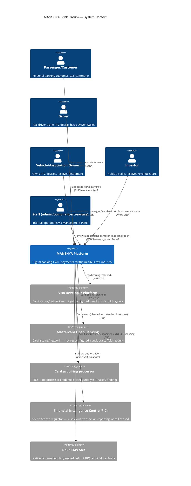
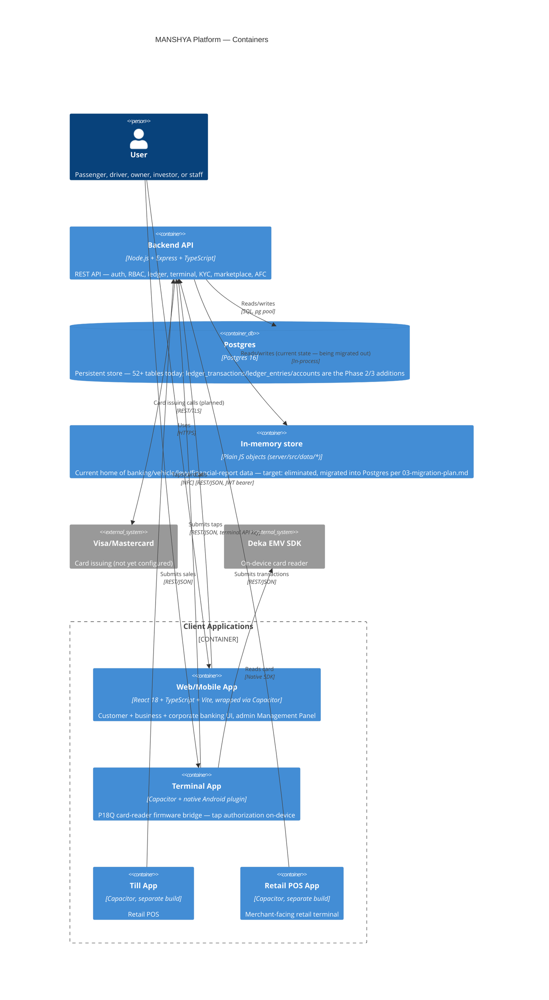
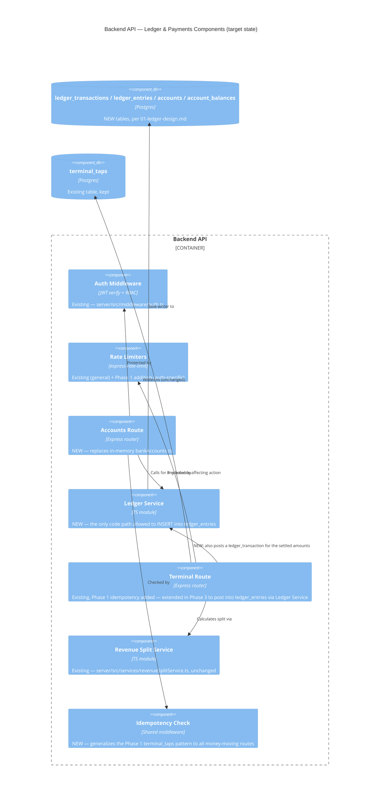

# Target Architecture — C4 Diagrams

**Status:** Phase 2 design document, describing the target state referenced
throughout this `plans/architecture/` set. Current state differs in the
ways called out in `03-migration-plan.md` — most importantly, no ledger
database exists yet.

## Level 1: System Context

Who and what talks to this platform, at the coarsest level.

## Level 2: Containers

## Level 3: Component — Backend API (ledger-relevant slice only)

Full component-level detail for all 42 route files isn't useful here — this
zooms in on the piece Phase 2/3 actually changes: the money-moving path.

The key architectural rule this enforces: **`ledger_entries` has exactly
one writer** (the Ledger Service). No route handler ever runs a raw
`INSERT INTO ledger_entries` itself — every money movement, whether it
comes from a P2P transfer, a card payment, or an AFC tap settlement, goes
through the same module. That's what makes the double-entry invariant
(every transaction's entries sum to zero) actually enforceable in code
rather than just a convention people remember to follow.
